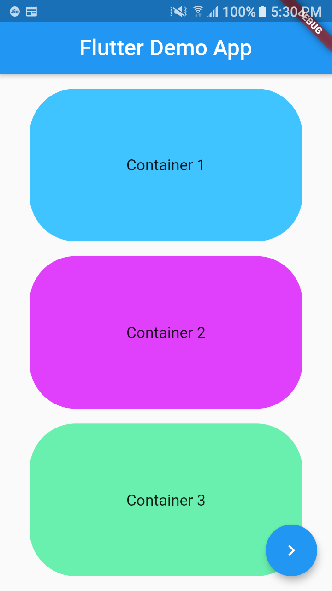
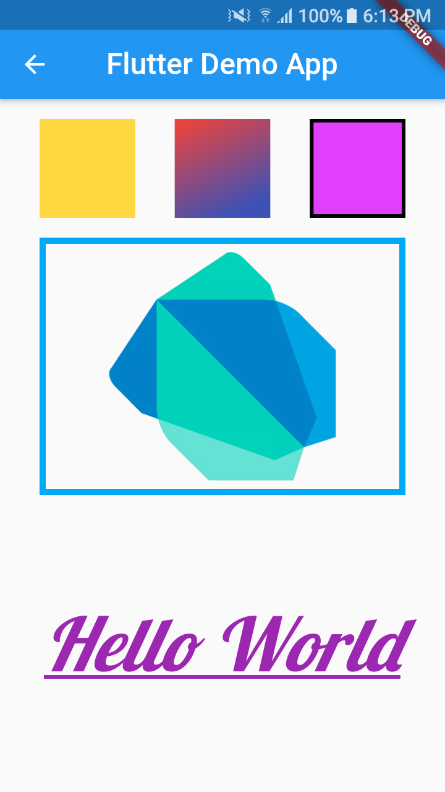

## Task 1
- This is basically my first project in Flutter which helped me clear my fundamentals and helped me gain in-depth knowledge of how the structure/architecture of Flutter works, what is a widget and how do we use it and what widgets are used to achieve the desired result.
### What features, widgets, properties and other fundamentals are covered in this app?
- `Scaffold`: First and basic one to start with is `Scaffold` widget which implements the basic material design visual layout structure of the flutter app.

- `Appbar`: `Appbar` is basically a top header section of an app which contains of title of the screen, some toolbars or some other widgets too.

- `Container`: A `Container` is a widget which helps in creating, decorating or positioning the child widgets. It kind of encapsulates the child widget in a box like shape i.e. `container`. I've used the properties like `color`, `margin`, `padding` in my container. Also, the `shape`, `border` and `borderRadius` properties of container can be changed. There are many such other properties.

- `Column`: It is a widget which is used to display the child widgets in a vertical manner. It basically doesn't scroll. So to add the scroll effect, the `ListView` widget can be used. In a `Column`, to center(or align) vertically, `mainAxisAlignment` is used and to center(or align) horizontally, `crossAxisAlignment` is used.

- `mainAxisAlignment`: `mainAxisAlignment` is how items are aligned on that axis.

- `crossAxisAlignment`: `crossAxisAlignment` is how items are aligned on the other axis.

- `Expanded`: The `Expanded` widget helps you fill the `Row` and `Column` as per our desire. When normally a `Row` or a `Column` is declared, the child widgets are arranged as per the user's requirements. Now I want my child widgets to be spaced evenly with respect to each other and take up the extra space, and hence I've used the expanded widget.

- `BoxDecoration`: It basically helps to edit the properties of the container like `shape`, `border`, `border radius`, `color` etc.

- `Alignment`: This property helps to `align` the child widget in it's parent widget.

- `SizedBox`: A box with a specified size which helps in adding a space between the two widgets. If given to a child, this widget forces its child to have a specific width and/or height (assuming values are permitted by this widget's parent). If not given to a child, `SizedBox` will try to size itself as close to the specified height and width as possible given the parent's constraints.

- `FloatingActionButton`: A `Floating Action Button` is a basically a button that floats on your screen and does the assigned operation to it. You can simply add it into your Scaffold by writing `floatingactionbutton: FloatingActionButton`. In this app, I've added the floating action button to navigate to the next page. So, when I push the button it directs me to a next new page. For this, I used `Navigator.push` property for the `onPressed` action. And with the help of `MaterialPageRoute`, the button navigates me to the next mentioned screen i.e SecondScreen of my app. Also, in the button that I've used, I've kept the icon of `navigat_next`. Flutter's icon library has helped me in finding the appropriate icon which shows what action the button does.

- `Row`: `Row` is used to display it's child widgets on a horizontal scale. In a `Row`, to center(or align) vertically, `crossAxisAlignment` is used and to center(or align) horizontally, `mainAxisAlignment` is used.

- `Adding an Image`: Now, in the second screen, I've added an image. For that, I first created a folder in my `task1` directory by the name `assets` and added my image in the assets directory. Now, as in flutter, you have to declare the image that you are going to use in the `pubspec.yaml` file under the assets section. So I simply just gave the path to the image in the `pubspec.yaml` file. After that, the dart file has to get the necessary dependencies because of the edits that I've made in my `pubspec.yaml` file and then after, I simply imported the image in my app via `AssetImage`.

- `Adding custom fonts`: Also, the custom `Google fonts` can be used in Flutter. There are two ways to do this, first is through editing the `pubspec.yaml` file just it was done for importing image. The second method is more efficient in which the Google font package is imported directly and then the dependency of the package is added in the `pubspec.yaml` file under the dependency section by specifying the version number of the API. And then, the desired font from the font range of 977 fonts can be used by simply specifying the name of the font in the given manner `style: GoogleFonts.font_family`.

## Screenshots:

